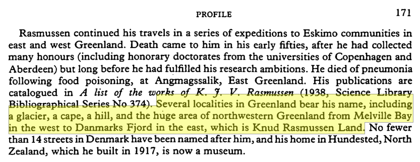
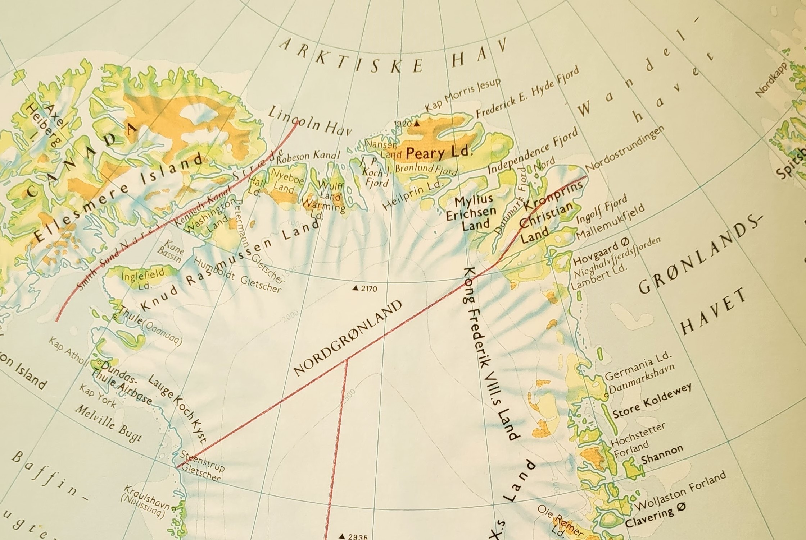
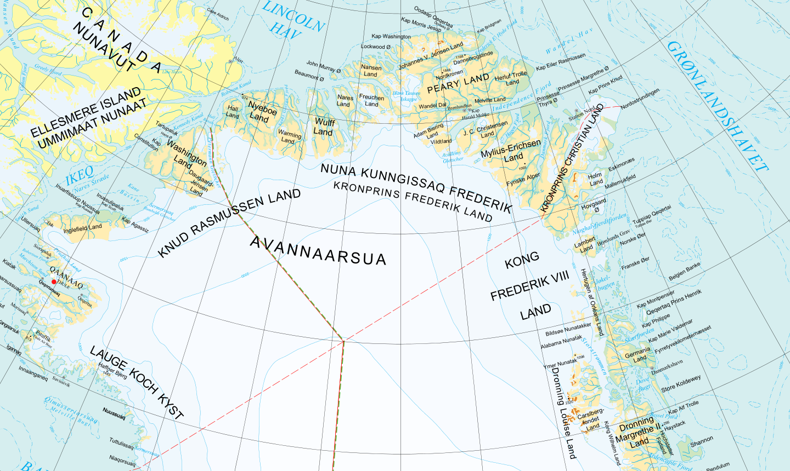

Knud Rasmussen was a great Arctic explorer, and in honor of his exploits, a large swathe of land on the northern coast of Greenland was named after him. Answering where exactly this Knud Rasmussen land is, however, can be a complicated task, especially after much of Northern Greenland was named Kronprins Frederik land in 2000. Where does Knud Rasmussen land start? Where does it stop? And how much was taken for the crown prince in 2000? Let us dive into some historical sources.

A good reference to start with is a profile submitted to the Polar Record (Gilberg, 1984), which states that Knud Rasmussen land ranges “from Melville Bay in the west to Danmarks Fjord in the east“, see full quote in Fig. 1.

If we look at a map (Gyldendal, 1988) from the same decade, this definition is supported, see Fig. 2. 

Melville Bay lies in the lower left of the map, while Danmark Fjord lies at the upper center, between Mylius Erichsen land and Kronprins Christian land.
However, in 2000 the Danish crown prince Frederik and the Sirius patrol, which enforces the sovereignty of Greenland and the Danish Realm, finished Ekspedition Sirius 2000. Upon arriving back at the airport in Copenhagen, the prince was greeted by the Prime Minister of Greenland, Jonathan Motzfeldt, who declared that a portion of Northern Greenland would now be named Kronprins Frederik land. He stated that it lay “next to Knud Rasmussen land” (Ritzau, 2000), similar to the definition found in the Danish online lexicon (Rasmussen, 2015), which states that Kronprins Frederik land is bordered by Peary Land to the south (sic, probably meant to be north), Kong Frederik 8.s Land to the east, and Knud Rasmussen land to the west. A current map of the area (Kortforsyningen, 2020) indicates that Kronprins Frederik land corresponds to what was previously the western half of Knud Rasmussen land, running from Danmarks Fjord to approximately Wulff Land.

So where is Knud Rasmussen land? It would appear that it used to stretch from Melville Bay in the west to Danmarks Fjord in the east, but was reduced by half in 2000 to end at Wulff Land in the east.

Figure 1: A reference on Knud Rasmussen land from 1984.

Figure 2: Map of Greenland from 1988, showing Knud Rasmussen land, Melville bay and Danmark Fjord.

Figure 3: Current map of Greenland, indicating the border between Knud Rasmussen Land and Kronprins Frederik Land to be near Wulff land.

### References

Gilberg, R. P. (1984). Profile: Knud Rasmussen, 1879-1933. Polar Record, 22(137), 169-171.

Gyldendal. (1988). Grønland (Kalallit Nunaat). In Gyldendals Atlas (p. 46). Hong Kong: Gyldendal.

Kortforsyningen. (2020). Grønland 1:10.000.000. Retrieved January 31, 2020, [link](download.kortforsyningen.dk/content/gr%C3%B8nland-110000000)

Rasmussen, R. O. (2015, January 23). Kronprins Frederik Land. Retrieved January 31, 2020, from Den Store Danske: [link](denstoredanske.lex.dk/Kronprins_Frederik_Land)

Ritzau. (2000, June 14). Grønlandsk område bærer kronprinsens navn. Retrieved January 31, 2020, from Jyllands-posten.dk: [link](jyllands-posten.dk/indland/ECE3288886/Gr%C3%B8nlandsk-omr%C3%A5de-b%C3%A6rer-kronprinsens-navn/)

